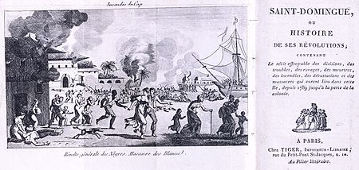

# Révolution haïtienne


##### [Lien vers la page wikipédia](https://en.wikipedia.org/wiki/Haitian_Revolution)

La **révolution haïtienne** constitue la première révolte d’[***esclaves***](https://fr.wikipedia.org/wiki/Esclavage) réussie du monde moderne. Les historiens situent traditionnellement son départ lors de la cérémonie vaudoue du Bois-Caïman2, en août 1791. Après treize années de conflit armé qui entrainent des dizaines de milliers de morts et l'émigration massive de quasiment toute la population blanche de la colonie, elle établit en 1804 Haïti en tant que premier peuple noir libre du Nouveau Monde, succédant à la colonie française de Saint-Domingue, mais sans que les conflits armés cessent ensuite.

>##                    **Révolution haïtienne**

##### La *Bataille de Saint-Domingue**, huile sur toile de janvier Suchodolski, 1845, Musée de l'Armée polonaise, Varsovie.
> ## **information générales**
> **Date** 22 août 1791-1er janvier 1804
</br>
**Lieu** Haïti  
**Issue** Victoire des rebelles haïtiens
</br>
-------
> ## **Belligérants**
> - Royaume de France, puis
> - République française
> - Esclaves noirs insurgés royalistes (1791-1793)
> - Grande-Bretagne (1799-1804)
> - Royaume d'Espagne (1793-1795)
> - Royalistes français
> - Rebelles haïtiens (1802-1803)
-------
> ## **Commandants** 
> 
> **1791-1802**
> 1.  Léger-Félicité Sonthonax
> 2.  Étienne Polverel
> 3.  Étienne de Lavaux
> 4. Toussaint Louverture
> 5.  André Rigaud
> 6.  Jean-Jacques Dessalines
> 7. Gabriel d'Hédouville

> **1791-1802**
> 1. Dutty Boukman
> 2. Jean-François
> 3. Georges Biassou
> 4. Toussaint Louverture 
> 5. Jean-Jacques Dessalines
</br>

<!-- Il est à noter qu'haiti est la première république noir -->
`Forces en présence`
```JS
int haiti = 10;
int France = 1;

if (haiti>France){
cout << "\n60 000 soldats" << "\n86 navires de guerre" << "\n55 000 soldats" << "\nréguliers" << "\n100 000 volontaires" << "\nAnglais" << "\n31 000 hommes";

Cout << "La France a Perdu";
}

```

</br>
</br>
</br>

## Origines
---------------------


###### Couverture de l'ouvrage Saint-Domingue ou Histoire de ses révolutions, 1791-1804.

</br>
</br>
À la veille de la Révolution française, la colonie de Saint-Domingue était d'une prospérité et d'une richesse sans égale dans les Antilles. En 1789, elle était la première productrice mondiale de sucre et de café — la colonie représentait en effet la moitié de l'offre mondiale de café. Son commerce extérieur représentait plus du tiers de celui de la France métropolitaine et un Français sur huit en vivait directement ou indirectement,

Le système mercantiliste de l'« Exclusif colonial », inventé par Jean-Baptiste Colbert, visait à enrichir la métropole. Il reposait sur le monopole commercial et l’interdiction de l’industrie locale. La métropole fixait les prix.

La société des colons était très inégalitaire : aux riches planteurs, ou « grands Blancs »4 issus de la noblesse ou de la bourgeoisie du grand négoce, répondait la foule des petits fonctionnaires, employés et ouvriers, appelés « petits Blancs ».

Surtout, l'esclavage était particulièrement cruel. Le Code noir de 1685, pourtant édicté pour l'« humaniser », punissait ainsi de mort l'esclave qui aurait frappé son maître (art. 33), voire aurait commis un vol (art. 35). L’esclave avait le statut juridique d’un bien meuble (art. 44). Les abolitionnistes, tels Benjamin-Sigismond Frossard, affirment qu'il n'était même pas respecté5 : l'obligation d'évangélisation était négligée6. À la peine capitale prévue, les décisions de justice ajoutaient souvent des supplices pour leur caractère exemplaire, particulièrement en cas de marronnage (esclavage).

L'évangélisation, probablement en progrès au 17e siècle, mais en recul au 18e siècle, n'était faite que dans la mesure où elle servait les intérêts des propriétaires. Au 19e siècle elle reste superficielle, malgré le travail des protestants. En général les esclaves reçoivent le baptême, mais ce   sacrement a surtout valeur d'entrée dans la société coloniale et il est prétexte à une hiérarchie artificielle au sein des esclaves eux-mêmes. Toutefois, par le système du parrainage, le baptême, au départ moyen pour le propriétaire d'accroitre son emprise sur l'esclave, devient un moyen pour l'esclave de gagner un peu d'émancipation sur le maitre.

</br>

## L'indemnité réclamée par la France pour reconnaitre l'Indépendance

Il faut attendre 1825 pour que la France de Charles X « concède » l'indépendance à Haïti, moyennant le paiement d'une indemnité de 150 millions de francs or pour « dédommager les anciens colons ». Renégociée en 1838 à 90 millions (17 milliards d'euros en 2012), cette dette d'indépendance a été entièrement honorée par versements successifs jusqu'en 1883. Cependant, le versement des agios de l'emprunt généré par cette dette s'étalera jusqu'au milieu du xxe siècle. Selon Louis-Philippe Dalembert, cette dette aura contribué à la grande pauvreté qui touche encore le pays78.
